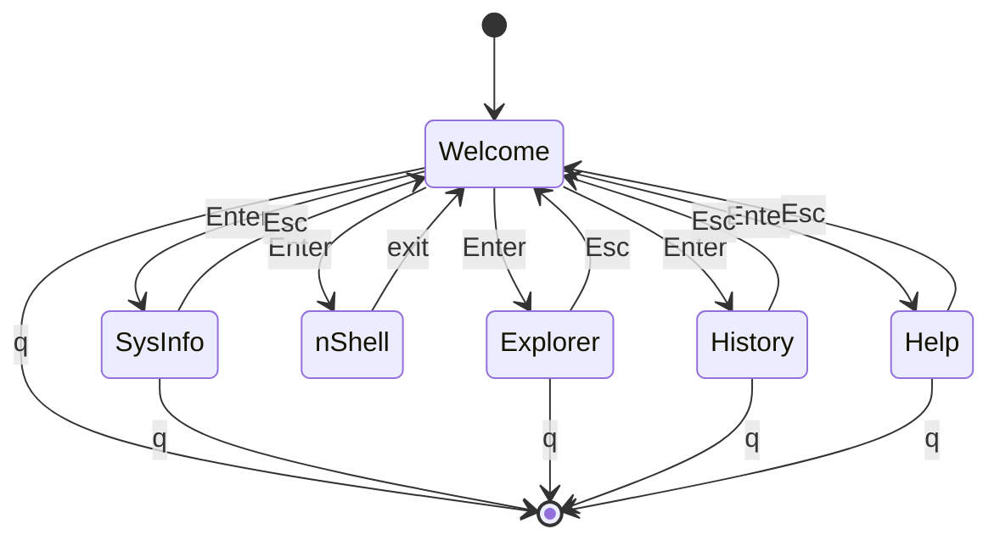

# TermUI

A terminal file explorer and shell written in C. Drives the terminal directly via POSIX syscalls and VT100/ANSI escape sequences — no ncurses or other TUI library underneath — so that the syscall layer stays visible. It's a learning project for terminal internals.

## Features

- **File explorer** — `ls -l` style listing with directory descent and forward/back path history.
- **nShell** — embedded shell with built-ins, external commands, I/O redirection, and logical chaining.
- **Session history** — every menu choice and shell command lands in a ring buffer, browsable in its own view.
- **System info** — kernel and host details via `uname(2)`.
- **No external dependencies.** Stdlib + POSIX only; Unity is vendored for tests.

## State machine

TermUI is a hub-and-spoke state machine. `main()` loops around the home screen; selecting a menu entry dispatches into one of five state functions, each of which runs its own inner loop and returns to the hub or exits the program.



The two control keys mean different things: `q` exits the app from anywhere, `Esc` returns to Welcome. nShell is the exception — it runs in canonical mode while reading commands, so `q` is just a character. The only way out is the `exit` built-in.

## Project structure

```
TermUI/
├── src/
│   ├── main.c              # App lifecycle
│   ├── home.c              # Welcome menu + choice dispatch
│   ├── terminal.c          # Raw mode, cursor_scroll, window size
│   └── choices/            # One file per state
│       ├── explorer.c
│       ├── nshell.c
│       ├── history.c
│       ├── sysinfo.c
│       └── help.c
├── include/
│   ├── common.h
│   ├── home.h
│   ├── terminal.h
│   ├── choices/            # Per-state headers
│   └── commands/           # Per-command headers
├── commands/               # Standalone command sources
├── unity/                  # Unity test framework (vendored)
└── Makefile
```

## Build

Requires `cc` (gcc or clang) and a POSIX system (Linux or macOS).

```bash
make           # builds app + commands + tests
make termui    # only the main binary
make test      # runs Unity tests
make clean
```

The main binary lands at `bin/termui`; command binaries at `bin/commands/<name>`.

> `CMD_PATH` in `include/choices/nshell.h` is currently a hardcoded absolute path. Update it to match your checkout before building.

## Running

```bash
./bin/termui
```

Welcome shows a numbered menu. Use ↑/↓ to move the cursor and Enter to select. `q` exits.

## Input handling

Every screen — the home menu, the explorer listing, the file viewer, the history browser — reads keyboard input through one function: `cursor_scroll`. New screens declare their item count and the features they want, and reuse the keyboard handling, cursor movement, and escape-sequence decoding underneath.

```c
POS cursor_scroll(POS start, int scroll_len, int control_flags);
```

The function takes a starting position, the number of selectable items, and a bitmask of feature flags from `terminal.h`. Each flag enables one specific behaviour:

| Flag | Effect |
|---|---|
| `ENTER_ENABLED` | Enter selects the item under the cursor and returns |
| `HORIZONTAL_NAV` | Left/Right move the cursor horizontally within the view |
| `DIRECTORY_TRAVERSAL` | Left/Right return `LEFT_TRAV_CODE`/`RIGHT_TRAV_CODE` so the caller can walk forward/back through navigation history |

Each screen picks only the flags it needs. The home menu uses `ENTER_ENABLED` alone. Explorer's directory view sets `ENTER_ENABLED | DIRECTORY_TRAVERSAL`. The file viewer uses `HORIZONTAL_NAV` for sideways scrolling.

The return value is a `POS` whose `c_vert` field carries the result. A positive value is the selected item's index. Negative values are sentinels: `ESCAPE_CODE` for Esc, `QUIT_CODE` for `q`, and `SCROLL_ONE_UP_CODE` / `SCROLL_ONE_DOWN_CODE` when the cursor hits the top or bottom of the visible area. The scroll sentinels let the caller advance its data buffer by one row and re-enter `cursor_scroll`.

Internally, the function loops on `read(STDIN_FILENO, buf, 10)`. By this point the terminal is already in raw mode: `non_canonical_mode()` runs before any view is entered, clearing `ICANON` and `ECHO` and setting `VMIN=1` and `VTIME=0`. The byte count from `read` drives the dispatch — one byte is a printable key (Enter, Esc, or `q`); three bytes is an arrow-key sequence (`\033[A`/`B`/`C`/`D`) matched with `memcmp`. Cursor movement is acknowledged by echoing the same escape back to the terminal, letting the terminal handle the visible cursor itself.

## System calls

Used directly throughout the codebase:

| Syscall / API | Where |
|---|---|
| `tcgetattr` / `tcsetattr` | `terminal.c` — raw / canonical mode toggle |
| `ioctl(TIOCGWINSZ)` | `terminal.c` — window dimensions for clamping |
| `read` / `write` | All input and output; `printf` is avoided for rendering |
| `open` / `close` | File viewing in Explorer; redirection target in nShell |
| `dup` / `dup2` | nShell — save and restore stdin/stdout/stderr around redirects |
| `opendir` / `readdir` / `closedir` | Explorer and `ls` |
| `stat` | Explorer — file metadata |
| `getpwuid` / `getgrgid` | Explorer — resolve uid/gid to names |
| `getcwd` / `chdir` | nShell `cd`; Explorer path tracking |
| `fork` | nShell command execution; Explorer file viewer |
| `execv` | nShell — invokes binaries under `bin/commands/` by absolute path |
| `wait` | nShell — reap children, capture exit status for `&&`/`||` |
| `uname` | SysInfo |

## Escape sequences

Defined in `terminal.h`:

| Sequence | Effect |
|---|---|
| `\033[H` | Move cursor to home |
| `\033[J` | Clear from cursor to end of screen |
| `\033[2J` | Clear whole screen |
| `\033[3J` | Clear scrollback (non-standard; defined but unused in `clear_terminal`) |
| `\033[?7l` / `\033[?7h` | Disable / enable line wrap |
| `\033[%d;%dH` | Absolute cursor positioning |
| `\033[1m` / `\033[0m` | Bold on / off |

## nShell

nShell parses a command line into a linked list of `Command` nodes — one per stage, each carrying its argv, its redirects, and a connector token (`&&`, `||`, `|`) pointing to the next stage. Built-ins (`exit`, `cd`, `pwd`, `echo`) execute in-process. Everything else is run as `bin/commands/<name>` via `fork` + `execv` + `wait`.

Standard I/O redirection (`<`, `>`, `>>`, `2>`, `&>`) is fully supported: each opens its target file and `dup2`s it onto the relevant fd. The original fds are saved with `dup` at shell start and restored after every command.

`&&` and `||` are evaluated against `WEXITSTATUS`. Pipe execution is in progress — see [Work in progress](#work-in-progress).

## Commands

Each command compiles to a standalone binary under `bin/commands/` and is invoked from nShell:

| Command | Flags |
|---|---|
| `ls` | `-a` (all), `-R` (recursive), `-1` (one per line) |
| `cat` | `-b` (number non-blank lines), `-n` (number all lines) |
| `copy` | `-r` / `-R` (recursive), `-v` (verbose) |
| `mkdir` | `-m <mode>`, `-v` (verbose) |

## Work in progress

- **Pipe execution.** The parser already builds a chain of `Command` nodes joined by `|`, but the execute branch is empty. Filling it in needs `pipe(2)` for the fd pair, an extra `fork` per stage, `dup2` to rewire stdin/stdout in each child, and disciplined `close` on the parent so EOF propagates.
- **`rm`, `mv`, `grep`.** Not present under `commands/` yet.
- **Help screen.** `display_info()` in `src/choices/help.c` is currently a stub — Help opens an empty screen.

## Future enhancements

- **`SIGWINCH` handling** — window size is sampled at each view entry, but a resize during scrolling doesn't trigger a redraw.
- **Portable `CMD_PATH`** — resolve the commands directory relative to the binary instead of hardcoding an absolute path.